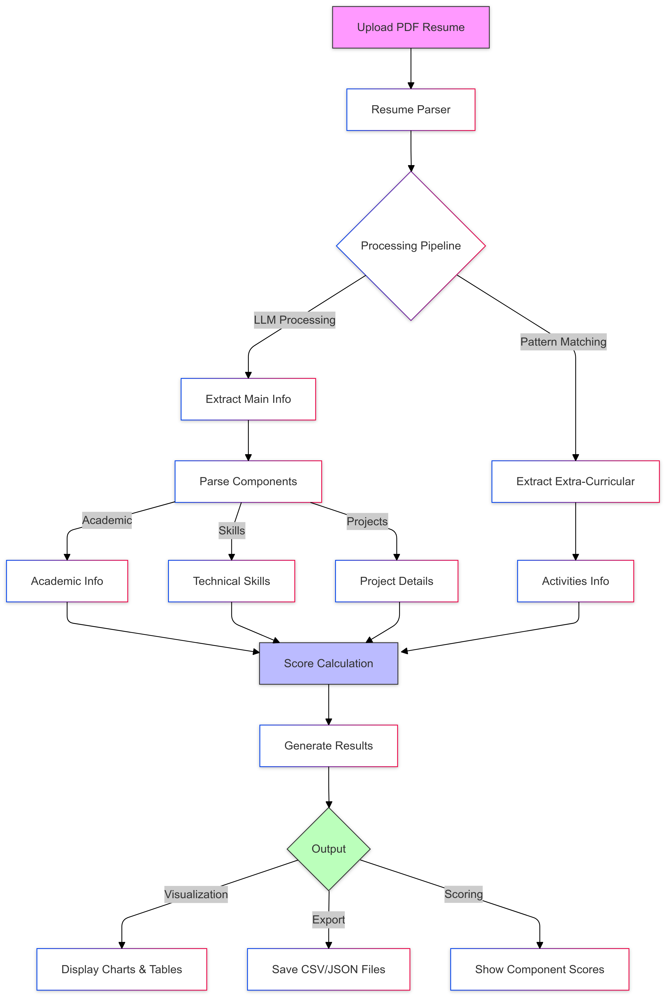

# Resume Screener

A powerful resume parsing and scoring system built with Streamlit and LLM technology. The system extracts structured information from resumes and provides a comprehensive scoring based on multiple components.

## Features

### 1. Resume Parsing
- **Main Information**: Uses LLM to extract structured data including:
  - Personal Information (name, contact details, etc.)
  - Academic Performance
  - Technical Skills
  - Projects and Internships

- **Extra-Curricular Activities**: Uses pattern-based extraction for:
  - Leadership Roles
  - Awards and Achievements
  - Certifications
  - Activities and Involvement
  - Language Proficiency

### 2. Scoring System

The system employs a 100-point scoring mechanism divided into four components:

#### A. Academic Performance (20%)
- Formula: `(CGPA × 0.75) + ((10 - Std Dev) × 0.25)`
- Considers both CGPA and consistency across semesters
- Standard deviation of SGPAs used to measure consistency
- Score normalized to maximum of 20%

#### B. Technical Skills (35%)
Points allocated based on number of skills in each category:
- 0 skills: 0 points
- 1-3 skills: 1 point
- 4+ skills: 2 points

Categories:
- Programming Languages
- Frameworks
- Databases
- Other Technologies
- Knowledge Areas

Maximum raw points: 10 (2 points × 5 categories)
Final score normalized to 35%

#### C. Projects (30%)
Points per project:
- Base Project: 5 points
- Internship Bonus: +5 points (if company is not "personal", "na", or "n/a")
- Technical Relevance: 0-10 points based on:
  - Programming Languages used
  - Frameworks utilized
  - Databases implemented
  - Knowledge areas applied

Score normalized to maximum of 30%

#### D. Extra-Curricular Activities (15%)
Points allocated based on total number of activities across:
- Leadership Roles
- Awards
- Certifications
- Activities

Scoring scale:
- 0 activities: 0 points
- 1-3 activities: 1 point
- 4+ activities: 2 points

Score normalized to maximum of 15%

### 3. Data Export
- Structured CSV files for each component
- Raw LLM response in JSON format
- Comprehensive metadata with scores

## Setup

1. Install dependencies:
```bash
pip install -r requirements.txt
```

2. Set up environment variables in `.env`:
```env
DEEPSEEK_API_KEY=your_api_key
DEEPSEEK_URL=your_api_url
```

3. Run the application:
```bash
streamlit run app.py
```

## Output Structure

The system generates the following files under `data/parsed_data/{reg_no}/`:

1. `{reg_no}_metadata.csv`: Personal information and overall scores
2. `{reg_no}_academic.csv`: Semester-wise academic performance
3. `{reg_no}_skills.csv`: Technical skills breakdown
4. `{reg_no}_projects.csv`: Project and internship details
5. `{reg_no}_extracurricular.csv`: Extra-curricular activities

Raw LLM responses are stored in `data/raw_responses/{reg_no}/llm_response.json`

## UI Features

1. **Interactive Dashboard**
   - Upload interface for PDF resumes
   - Real-time parsing and scoring
   - Visual score breakdown

2. **Detailed Visualizations**
   - Academic performance trends
   - Score distribution charts
   - Skills and project matrices

3. **Data Export**
   - Download parsed data in CSV format
   - Access raw LLM responses
   - Export structured metadata

## Technical Implementation

1. **LLM Integration**
   - Uses DeepSeek API for main resume parsing
   - Structured output using Pydantic models
   - Token usage tracking

2. **Pattern-Based Extraction**
   - Custom extractor for extra-curricular activities
   - Regex-based section identification
   - Smart text cleaning and formatting

3. **Scoring System**
   - Component-wise score calculation
   - Normalization for each category
   - Weighted aggregation for final score

## Prerequisites

- Python 3.8+
- Deepseek API credentials
- PDF files in NITK resume format

## Installation

1. Clone the repository:
```bash
git clone https://github.com/yourusername/resume-parser.git
cd resume-parser
```

2. Create and activate a virtual environment (recommended):
```bash
python -m venv venv
source venv/bin/activate  # On Windows: venv\Scripts\activate
```

3. Install required packages:
```bash
pip install -r requirements.txt
```

4. Set up environment variables:
Create a `.env` file in the project root with:
```plaintext
DEEPSEEK_API_KEY=your_api_key_here
DEEPSEEK_URL=https://api.deepseek.com
```

## Usage

### Option 1: Batch Processing (Command Line)

Use this option when you have a combined PDF containing multiple resumes and want to:
- Split them into individual PDFs
- Extract information from each resume
- Save the data in CSV format

1. Place your combined PDF in the data folder:
```bash
mkdir -p data
cp your_combined_resumes.pdf data/resumes_compiled.pdf
```

2. Run the main script:
```bash
python -m resume_parser.main
```

The script will:
- Split the combined PDF into individual resumes in `data/output/pdfs/`
- Create parsed data in CSV format in `data/output/parsed_data/`
- Each student's data will be in a separate folder named by their registration number

### Option 2: Interactive Web Interface

Use this option to analyze individual resumes with a visual interface.

1. Run the Streamlit app:
```bash
streamlit run app.py
```

2. Open your browser and go to `http://localhost:8501`

3. Use the interface to:
- Upload individual resume PDFs
- View parsed information in a structured format
- See academic performance visualizations
- Get skill summaries
- View project details

## Setting up Deepseek API

1. Sign up for a Deepseek account at [https://deepseek.com](https://deepseek.com)

2. Create an API key:
   - Go to your account settings
   - Navigate to API section
   - Generate a new API key

3. Add the API key to your `.env` file:
```plaintext
DEEPSEEK_API_KEY=your_api_key_here
DEEPSEEK_URL=https://api.deepseek.com
```

## Running Tests

Run the test suite to verify everything is working:
```bash
pytest tests/ -v --cov=resume_parser
```

## Architecture

