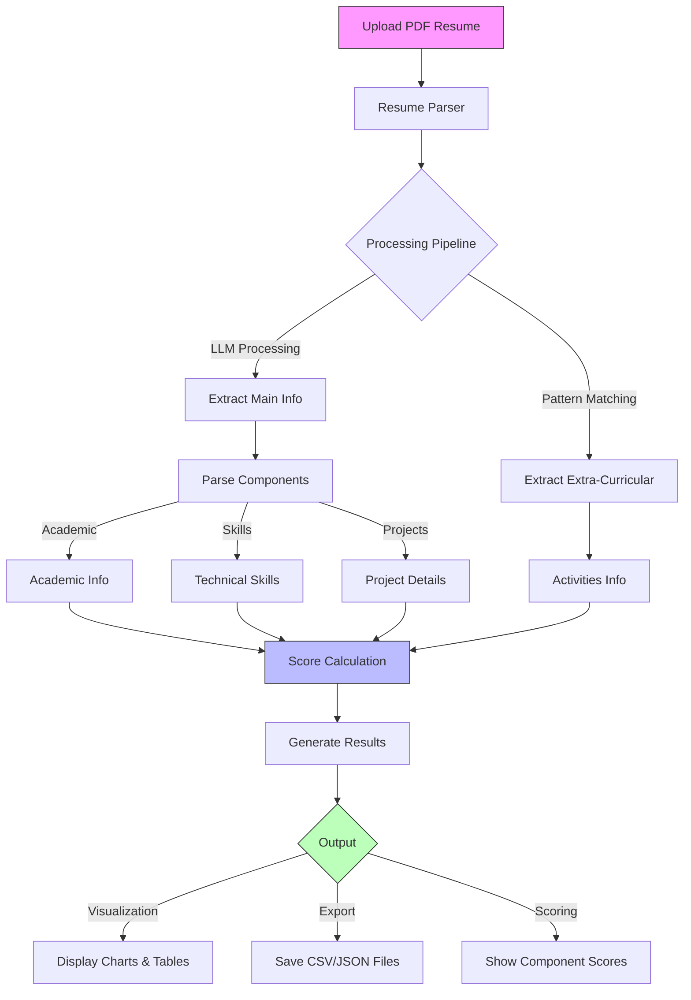

# Resume Screener Flow

## Component Weights
- Academic Performance: 20%
- Technical Skills: 35%
- Projects: 30%
- Extra-Curricular: 15%

## Key Features
1. **Dual Processing**
   - LLM-based main information extraction
   - Pattern-based extra-curricular extraction

2. **Scoring System**
   - Normalized component scoring
   - Weighted aggregation
   - Performance metrics

3. **Output Generation**
   - Interactive visualizations
   - Structured data export
   - Detailed scoring breakdown 